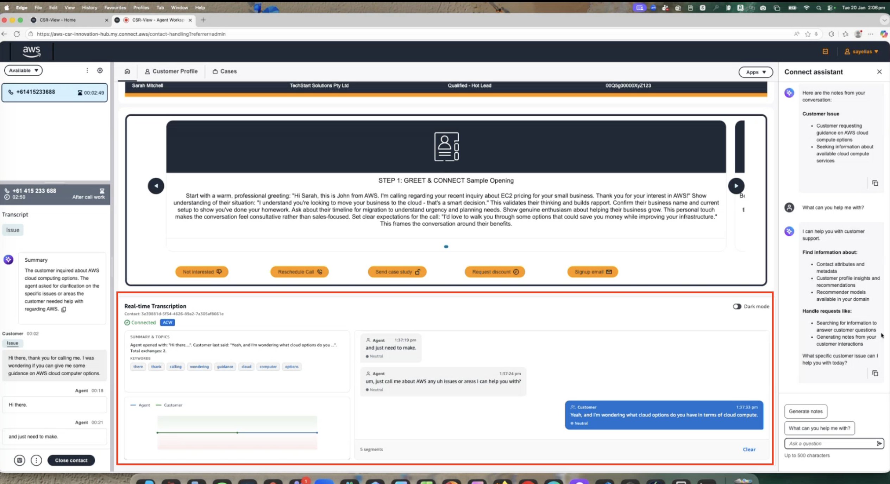

# Amazon Connect Real-time Transcript Viewer

A one-click CloudFormation solution that deploys a real-time transcript viewer for Amazon Connect calls powered by Contact Lens.

Deploy a single YAML file and get a live transcript viewer that displays caller and agent speech in real-time during active calls. Contact Lens streaming is configured automatically — no manual setup required.

## How It Works

Amazon Connect Call → Contact Lens → Kinesis → Lambda → DynamoDB → API Gateway → CloudFront Viewer

## What Gets Deployed

- Kinesis Data Stream for receiving Contact Lens real-time analysis
- Lambda functions for processing transcripts and serving the API
- DynamoDB table for storing transcript segments
- API Gateway REST endpoint
- CloudFront-hosted frontend viewer
- Automatic Contact Lens configuration

## Quick Start

See the [deployment instructions](#deployment-steps) below — everything is done through the AWS Console UI.

## What You Need Before Starting

1. An **Amazon Connect instance** with Contact Lens enabled
2. Your **Connect Instance ID** (looks like: `a1b2c3d4-5678-90ab-cdef-123456789012`)
3. An **S3 bucket** to store website files
4. This repository cloned or downloaded to your computer

## How to Find Your Connect Instance ID

1. Log into the **AWS Console**
2. Go to **Amazon Connect**
3. Click on your instance name
4. Look for **Instance ARN** - the Instance ID is the last part after `/instance/`
   - Example ARN: `arn:aws:connect:ap-southeast-2:123456789:instance/a1b2c3d4-5678-90ab-cdef-123456789012`
   - Your Instance ID is: `a1b2c3d4-5678-90ab-cdef-123456789012`

## Deployment Steps

### Step 1: Upload Website Files to S3

1. Log into the **AWS Console**
2. Go to **S3**
3. Click on your bucket (or create a new one)
4. Click **Create folder**
5. Name it `files` and click **Create folder**
6. Click on the `files` folder
7. Download staticFiles.zip from this repo and drop all files into the folder "files" on S3
8. Click **Upload**
9. Wait for upload to complete

### Step 2: Deploy the CloudFormation Stack

1. In the **AWS Console**, go to **CloudFormation**
2. Click **Create stack** → **With new resources (standard)**
3. Under **Specify template**:
   - Select **Upload a template file**
   - Click **Choose file**
   - Select the `tviewer-simple.yml` file
   - Click **Next**
4. On the **Specify stack details** page:
   - **Stack name**: Enter `transcript-viewer` (or any name you prefer)
   - **ConnectInstanceId**: Paste your Connect Instance ID
   - **SourceBucket**: Enter your S3 bucket name
   - **SourcePrefix**: Leave as `sydney-frontend-actual/`
   - Click **Next**
5. On the **Configure stack options** page:
   - Leave everything as default
   - Click **Next**
6. On the **Review** page:
   - Scroll to the bottom
   - Check the box: **I acknowledge that AWS CloudFormation might create IAM resources with custom names**
   - Click **Submit**

### Step 3: Wait for Deployment

The deployment takes about 5-10 minutes.

1. Stay on the CloudFormation page
2. Your stack will show **CREATE_IN_PROGRESS**
3. Click the refresh button occasionally
4. Wait until the status changes to **CREATE_COMPLETE** (green)

If you see **CREATE_FAILED** or **ROLLBACK**, check the **Events** tab for error messages.

### Step 4: Get Your Viewer URL

1. Click on your stack name `transcript-viewer`
2. Click the **Outputs** tab
3. Find the row with **CloudFrontURL**
4. Copy the URL (it will look like: `https://d1234abcd5678.cloudfront.net`)

### Step 5: Add the Viewer to Amazon Connect Agent Workspace

To display the transcript viewer inside the agent's workspace during calls:

1. Log into the **AWS Console**
2. Go to **Amazon Connect** → Click on your instance
3. In the left menu, click **Third-party applications**
4. Click **Add application**
5. Fill in the details:
   - **Display name**: `Transcript Viewer` (or any name you prefer)
   - **Access URL**: Paste the **AgentWorkspaceURL** from the CloudFormation Outputs tab
     - It will look like: `https://d1234abcd5678.cloudfront.net?embedded=true`
6. Click **Save**

The transcript viewer will now appear as a tab in the agent workspace during active calls.

Alternatively you can add it as an External App in a step-by-step guide.

### Step 6: Grant Agents Access to the Viewer

Agents need permission to see the third-party app in their workspace:

1. Log into your **Amazon Connect instance** (the admin URL)
2. In the left menu, go to **Users** → **Security profiles**
3. Click on the security profile assigned to your agents (e.g. **Agent**)
4. Scroll down to **Agent Applications**
5. Find **Transcript Viewer** (or the name you used in Step 5)
6. Check the box to enable it
7. Click **Save**

Agents will see the transcript viewer on their next login.

Alternatively you can add it in as an External App in a step by step guide.

## Testing

1. Make a test call through your Amazon Connect instance
2. Open the CloudFront URL in your web browser
3. You should see transcripts appearing in real-time during the call

